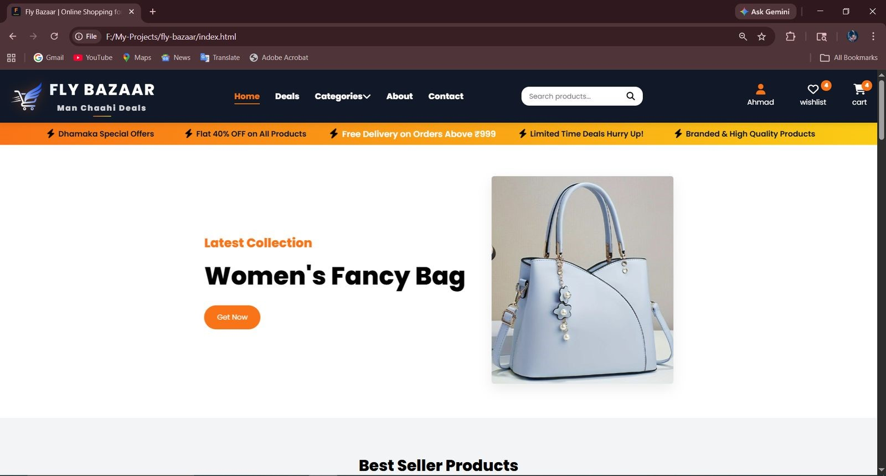
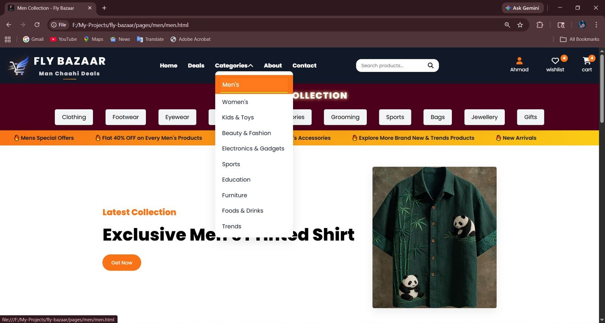
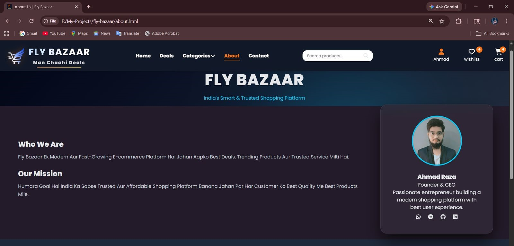
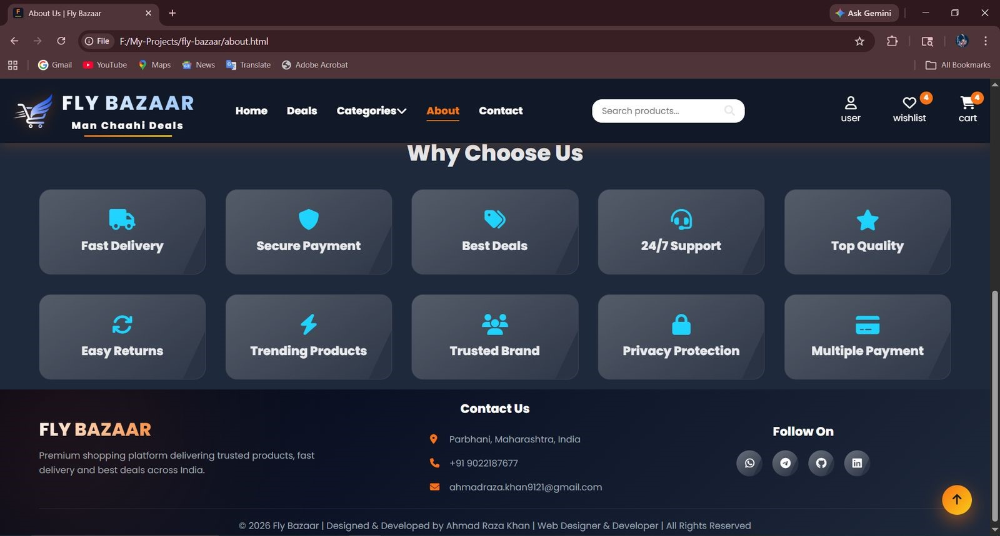

# 🛒 Fly Bazaar — E-Commerce Website

A fully responsive, multi-category e-commerce website built from scratch using vanilla HTML5, CSS3, and JavaScript. It features a large product catalogue, live search, cart & wishlist, product detail views, and production-style SEO, performance, and accessibility optimizations.

## 🔗 Links

- **Live Demo:** [Add your live demo link]
- **Portfolio:** [Add your portfolio link]
- **GitHub Repository:** [Add your repository link]

## 📸 Showcase & Interface Preview

<p align="center">
  <i>Explore the user interface, dynamic components, and layout architecture of <b>Fly-Bazaar</b>.</i>
</p>

---

### 🏠 01. Homepage & Hero Interface
> *Features the main landing section, live search bar, promotional hero banners, and core navigation structure.*

<div align="center">
  
</div>

<br>

### 📂 02. Product Categories Grid
> *Displays intuitive category filtering, product listings, and dynamic grid layouts across 40+ departments.*

<div align="center">
  
</div>

<br>

### ℹ️ 03. About Us & Brand Story
> *Presents brand information, platform values, vision, and responsive team showcase modules.*

<div align="center">
  
</div>

<br>

### 🦶 04. Footer & Navigation Links
> *Houses quick links, customer support details, newsletter subscription, and social media integration.*

<div align="center">
  
</div>

---

## ✨ Features

- 390+ products across 40+ categories
- Cart and wishlist with persistent state using `localStorage`
- Live product search with instant results and deep-linking to matching items
- Product detail view with quantity selector before add-to-cart
- Demo login/register modal
- Fully responsive layout for mobile, tablet, and desktop
- SEO optimized with meta tags, Open Graph tags, JSON-LD, `sitemap.xml`, and `robots.txt`
- PWA support via `manifest.json`
- Performance optimized with lazy-loaded and compressed images
- Accessibility-friendly with skip-to-content, keyboard navigation, ARIA labels, and visible focus states
- Custom 404 page
- Clean, modular file structure

## 🛠️ Tech Stack

- HTML5
- CSS3
- JavaScript (ES6+)
- LocalStorage
- Git & GitHub

## 📁 Project Structure

```bash
fly-bazaar/
├── .vscode/
├── assets/         # Main directory for all media assets and static files
│   │
│   ├── favicon/    # Multi-resolution favicons for browser tabs & devices
│   │   ├── apple-touch-icon.png
│   │   ├── favicon-16x16.png
│   │   ├── favicon-32x32.png
│   │   ├── favicon-512.png
│   │   └── favicon.ico
│   │
│   ├── images/     # Product assets organized by category
│   │   ├── beauty-imgs/                  # Cosmetics, skincare & beauty product media
│   │   ├── deals/                        # Promotional banners, discount tags, and special deal images
│   │   ├── education/                    # Images related to books, stationery, and learning materials
│   │   ├── electronics & cals/           # Electronics items, gadgets, and appliances images
│   │   ├── foods & drinks/               # Packaged food, grocery items, and beverage images
│   │   ├── furniture/                    # Home and office furniture product images
│   │   ├── home/                         # Products images For Homepage
│   │   ├── kids-imgs/                    # Children's clothing, toys, and baby care product images
│   │   ├── men-imgs/                     # Men's fashion, footwear, and apparel images
│   │   ├── sports/                       # Sports equipment, fitness gear, and athletic wear images
│   │   ├── trends/                       # Trending items, seasonal collections, and featured products
│   │   └── women-imgs/                   # Women's fashion, clothing, and accessory images
│   │
│   ├── project/    # Portfolio screenshots & project preview assets
│   │   ├── fly-bazaar-about.jpg
│   │   ├── fly-bazaar-categories.jpg
│   │   ├── fly-bazaar-footer-section.jpg
│   │   └── fly-bazaar-home-page.jpg
│   │
│   ├── favicon.svg
│   ├── fly-bazaar-logo.png   # Official brand logo of Fly-Bazaar
│   └── profile.jpg   # Developer/Author profile picture
│
├── css/        # Cascading Style Sheets (Stylesheet files) for layout & UI
│   ├── about.css
│   ├── cart.css
│   ├── contact.css
│   ├── page-styles.css
│   ├── responsive.css
│   └── style.css
│
├── js/         # JavaScript logic, data handling & dynamic behavior files
│   ├── cart.js
│   ├── main.js
│   └── products-data.js
│
├── pages/      # Dynamic HTML templates & category sub-pages
│   ├── beauty/                           # Beauty category pages & templates
│   │   └── beauty.html
│   ├── education/                        # Education category pages & templates
│   │   └── education.html
│   ├── electronics/                      # Electronics category pages & templates
│   │   └── electronics.html
│   ├── foods/                            # Food & beverages category pages
│   │   └── foods.html
│   ├── furniture/                        # Furniture category pages & templates
│   │   └── furniture.html
│   ├── kids/                             # Kids products category pages
│   │   └── kids.html
│   ├── men/                              # Men's fashion category pages
│   │   └── men.html
│   ├── sports/                           # Sports category pages & templates
│   │   └── sports.html
│   ├── trends/                           # Trending products category pages
│   │   └── trends.html
│   └── women/                            # Women's fashion category pages
│       └── women.html
│
├── .gitignore
├── 404.html
├── about.html
├── cart.html
├── contact.html
├── CONTRIBUTING.md
├── deals.html
├── index.html
├── LICENSE
├── manifest.json
├── README.md
├── robots.txt
├── SECURITY.md
├── sitemap.xml
└── wishlist.html


👤 Author

Ahmad Raza Khan

Web Developer & Designer

📍 Parbhani, Maharashtra, India

✉️ Email: ahmadraza.khan9121@gmail.com


📄 License & Usage

This project is proprietary and shared for portfolio/demo purposes only.

Note: All rights reserved. No copying, modification, redistribution, re-uploading
or derivative use is allowed without prior written permission from the author.

Viewing the project is allowed for evaluation only.

See the LICENSE file for full terms.
```
